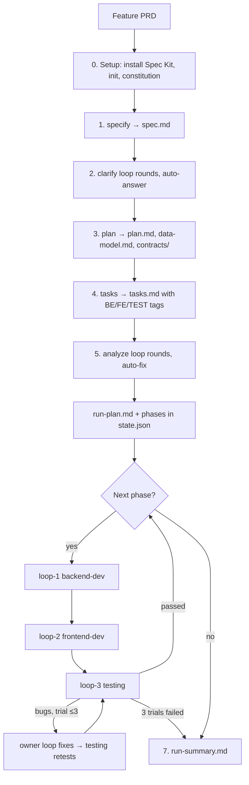
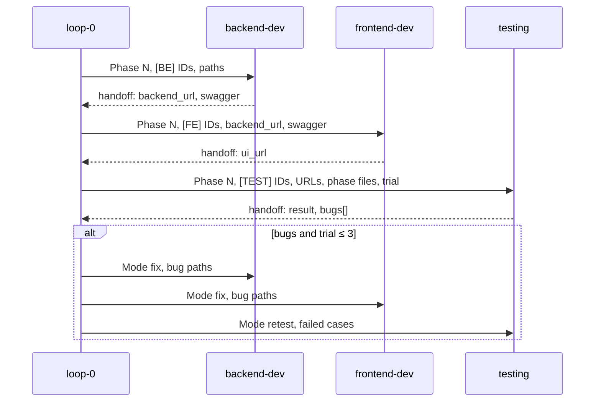

# How the flow works

This repo turns a feature PRD into a working, tested app (Spring Boot backend + Angular frontend) without anyone answering questions along the way. One command starts it:

```
/orchestrator <path/to/feature-PRD.md>      # e.g. /orchestrator Task_PRD.md
```

Four loops do the work. Each one is a Claude Code agent with its own folder, instructions and state:

| Loop | Agent | Owns | Writes code in |
|---|---|---|---|
| loop-0 orchestrator | `/orchestrator` command | Spec Kit pipeline, dispatching, state, summary | nothing (no app code) |
| loop-1 backend-dev | `backend-dev` | `[BE]` tasks | `backend/` → http://localhost:8080 |
| loop-2 frontend-dev | `frontend-dev` | `[FE]` tasks | `frontend/` → http://localhost:4200 |
| loop-3 testing | `testing` | `[TEST]` tasks | test code only (`backend/src/test/`, `*.spec.ts`) |

## The big picture



Steps 0–5 produce the specification. Step 6 builds it phase by phase. Step 7 writes the summary.

## Stage 1 — Specification (loop-0, Spec Kit)

loop-0 runs [Spec Kit](https://github.com/github/spec-kit) commands in order. Everything lands in `specs/<NNN-feature>/`, which is the single source of truth for all loops.

| Step | Command | Output | Notes |
|---|---|---|---|
| 0. Setup | `specify init`, `/speckit.constitution` | `.specify/`, constitution | Constitution = `tech-stack.yaml` + project principles (RFC 9457 errors, generated API client, every test traced to a user story…). Runs once. |
| 1. Specify | `/speckit.specify <PRD>` | `spec.md` | Feature dir recorded in state. |
| 2. Clarify | `/speckit.clarify` (repeated) | updated `spec.md` | Never asks the user: takes the *Recommended* option (or the safest one matching the PRD). Stops when no critical ambiguity is left; max 10 rounds. |
| 3. Plan | `/speckit.plan` | `plan.md`, `research.md`, `data-model.md`, `contracts/openapi.yaml`, `quickstart.md` | The OpenAPI contract is what the backend swagger and the frontend client must match. |
| 4. Tasks | `/speckit.tasks` | `tasks.md` | Tasks are split into numbered phases. Each task has exactly one owner tag: `[BE]`, `[FE]` or `[TEST]`. |
| 5. Analyze | `/speckit.analyze` (repeated) | fixes in spec / plan / tasks | Analyze is read-only, so loop-0 applies each recommended fix itself. Stops at zero findings; max 10 rounds. |

If clarify or analyze is still not clean after 10 rounds, the run stops with status `capped` and the open items go into `run-summary.md`. No code is written until analyze is clean.

loop-0 then writes `loops/loop-0-orchestrator/outputs/run-plan.md`, with one table per phase listing each task and its owner loop.

## Stage 2 — Build and test, one phase at a time (step 6)

For each phase in `tasks.md`, loop-0 runs the three loops **in order**. A loop with no tasks in a phase is skipped.

Before each dispatch, `scripts/preflight.sh` checks that the files and URLs the loop needs exist and answer. If one is missing, the phase is marked `blocked` and the run stops.

### loop-1 backend-dev
1. Mirrors its `[BE]` tasks into `outputs/phase-N-backend.md`.
2. Phase 1 only: creates the Spring Boot project from start.spring.io with the exact versions in `tech-stack.yaml`, plus springdoc, JaCoCo, H2 profiles, CORS for :4200 and problem+json errors.
3. Implements the tasks with `/speckit.implement`, ticking each task in `tasks.md`.
4. `./mvnw verify` must pass.
5. Generates the swagger (`./mvnw -Popenapi verify` → `backend/openapi/openapi.json`) and compares it with `contracts/openapi.yaml` until paths, operationIds, status codes, schemas and `required` lists all match.
6. Restarts the backend on :8080 and runs curl checks (success, 400, 404, other documented codes) for every endpoint in the phase.
7. Writes its handoff, which includes `backend_url`, `swagger_url`, `swagger_file` and `phase_file`.

### loop-2 frontend-dev
1. Mirrors its `[FE]` tasks into `outputs/phase-N-frontend.md`.
2. Phase 1 only: creates the Angular workspace (standalone, signals, zoneless) and the `api:gen` script.
3. Regenerates the API client from the backend swagger (`npm run api:gen` → `frontend/src/app/api/`) on every dispatch. **HTTP calls are never written by hand.** If the UI needs an endpoint the swagger lacks, the loop returns `blocked`.
4. Implements the tasks, then `ng build` must pass.
5. Restarts the dev server on :4200 and checks each feature against the real backend with the Playwright MCP tools (headless Chromium): main actions work, no console errors, screenshots saved.
6. Writes its handoff, which includes `ui_url` and `phase_file`.

### loop-3 testing
1. Plans test cases from the `spec.md` acceptance criteria. IDs look like `TC-P<N>-<BE|FE|E2E>-<NNN>`, and each case names its user story and acceptance criterion.
2. Runs unit tests with coverage for the backend (JaCoCo) and the frontend (`ng test --coverage`).
3. **Backend tests**: curl against every endpoint in the phase.
4. **Frontend tests**: Playwright MCP against every page in the phase.
5. **End-to-end tests**: does an action in the UI and checks it with curl, then changes data with curl and checks it shows in the UI.
6. Writes `phase-N-test-report.md` and ticks the passed `[TEST]` tasks.
7. Files one bug per failed case in `outputs/bugs/BUG-P<N>-<NNN>.md`, with exact repro steps and an owner: an API that is wrong goes to `backend-dev`, a UI that is wrong while the API is correct goes to `frontend-dev`.

loop-3 never fixes application code. It only reports.

### Bug-fix trials
When testing returns open bugs:

1. loop-0 increases the phase's trial count. **A phase gets at most 3 trials**; a 4th would mark the phase `failed` and stop the run.
2. Each owner loop is dispatched once in `fix` mode with all of its bugs, backend first so the frontend can regenerate its client from the new swagger. The loop appends a `## Fix` section to each bug and sets it to `fixed — awaiting retest`.
3. testing runs in `retest` mode: the failed cases plus all unit tests and end-to-end flows of the phase as regression. Each bug ends up `closed` or `reopened`.

When testing passes, the phase is set to `passed` and the next phase starts.

## Stage 3 — Finish (step 7)

loop-0 writes `loops/loop-0-orchestrator/outputs/run-summary.md`. It contains:
- the result and why the run stopped
- the number of clarify and analyze rounds
- a table per phase with status, trials, times and tokens
- every bug with its final status
- the final URLs
- the total tokens of the dispatched agents

`state.json.status` becomes `done`, `failed` or `blocked`.

## How the loops talk to each other

- **Paths and URLs only.** loop-0 never pastes content into a dispatch prompt. It sends a fixed template with the phase number, mode, task IDs (or bug paths), and the PRD, spec dir, tech stack, URL and handoff paths. Each agent reads the files itself.
- **Handoff files.** Every dispatch ends by writing `loops/<loop>/state/handoff-phase-<N>.json`. loop-0 reads that file, not the agent's chat reply, and copies it into its own `state.json`.
- **`tasks.md` is shared, ticks are not.** Only the owner loop ticks a task. Each loop's `outputs/phase-N-*.md` mirrors its tasks from `tasks.md` and must never diverge from it.
- **`tech-stack.yaml` is read-only** for every loop. Versions change only when a person edits that file.



## State, logs and resume

Every loop folder has the same layout:

```
loops/<loop>/
  Loop-instructions.md   # the process the agent follows
  task.md                # what the loop is for
  progress.md            # milestone table: time, step, status, duration, tokens
  state/                 # JSON state (resume source), handoffs, server pid/log
  outputs/               # one md per phase (+ reports, bugs, coverage, screenshots)
```

- loop-0 writes every change to `state/state.json` and `progress.md` **before** moving on. It uses `scripts/orch.py` (`set`, `append`, `get`, `log`) for these updates.
- Each dispatched agent's `total_tokens` and `duration_ms` go into `state.json.ledger[]`. loop-0's own tokens are only visible through `/cost`.
- **Resume:** run `/orchestrator` again and it continues from the first unfinished step. Inside step 6, it continues from the first phase that is not `passed` and that phase's first loop that is not `done`. Loop agents resume from their own `state.json` and skip tasks already ticked.
- A run whose status is `done` has nothing to resume. To start over, reset `loops/loop-0-orchestrator/state/state.json`.

## Running the result

```
cd backend && ./mvnw spring-boot:run      # http://localhost:8080, swagger UI at /swagger-ui/index.html
cd frontend && npx ng serve               # http://localhost:4200
```

You need JDK 25 on `JAVA_HOME` and Node ≥ 24.15 on `PATH`, as set in `tech-stack.yaml`. An older JDK fails with compile errors on records. An older Node makes the Angular CLI refuse to start. The frontend's backend address is `apiUrl` in `frontend/src/environments/environment*.ts`.
